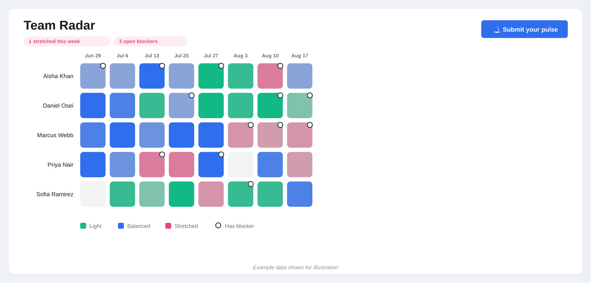

<p align="center">
  
</p>

<h1 align="center">SPFx Team Radar</h1>

<p align="center">
  A SharePoint Framework web part that turns a one-minute weekly check-in into a visual heatmap —
  so managers can spot workload spikes and blockers before they turn into burnout, at a glance.
</p>


## Preview



*Shown with mock data for illustration — live data is pulled from the SharePoint list you configure.*

## Why this exists

Most "team health" tracking is either a survey tool nobody opens results from, or nothing at all
until someone burns out and it's a surprise. This web part makes the pattern visible before that
happens: each person spends 20 seconds a week logging workload, mood, and an optional blocker, and
it renders straight into a color-coded grid — people as rows, weeks as columns — so a stretched
streak or a pile-up of blockers is obvious without reading a single response individually.

## Features

- **Weekly pulse form** — workload (Light / Balanced / Stretched), a 1–5 mood slider, and an optional blocker note.
- **Heatmap grid** — people × weeks, color blended from workload and mood, so intensity carries meaning at a glance.
- **Blocker indicators** — a small marker on any cell where someone flagged a blocker; hover for the detail.
- **Self-service, not surveillance** — everyone only ever submits their own pulse; there's no way to submit on someone else's behalf.
- **One entry per person per week** — resubmitting the same week updates your existing entry instead of duplicating it.
- **At-a-glance flags** — header banner surfaces how many people are stretched or have open blockers this week.
- **Fully permission-aware** — reads and writes through the current user's own SharePoint session (`SPHttpClient`); never bypasses list permissions.
- **No-code configuration** — list name, title, and how many weeks to show are all set from the property pane.

## How it's built

- **Framework:** SharePoint Framework (SPFx) 1.23, React, TypeScript
- **Build system:** Heft
- **UI:** Fluent UI (`@fluentui/react`)
- **Data access:** `SPHttpClient` against `_api/web/lists/getbytitle(...)/items`, with pagination handling and digest-based writes

## Required list schema

Create a SharePoint list (any name — you set it in the property pane) with these columns:

| Column | Type | Notes |
|---|---|---|
| Title | Single line of text | Auto-filled as `Person - WeekStartDate` |
| PersonName | Single line of text | Display name of the person submitting |
| WeekStartDate | Single line of text | Monday of the week, `YYYY-MM-DD` |
| Workload | Choice | `Light`, `Balanced`, `Stretched` |
| Mood | Number | 1–5 |
| Blocker | Multiple lines of text | Optional |

## Configuration

| Setting | What it does |
|---|---|
| Radar title | Heading shown above the grid |
| SharePoint list name | Exact title of the source list |
| Weeks to show | How many weeks of history the grid displays (4–12) |

## Getting started (development)

```bash
npm install
npm run serve
```

This opens the local SPFx workbench for development. To package for deployment:

```bash
npm run build
gulp bundle --ship
gulp package-solution --ship
```

This produces a `.sppkg` package under `sharepoint/solution/`, ready to upload to a SharePoint App Catalog and deploy to any site in a tenant.

## Disclaimer

Provided as-is, without warranty of any kind. This tool surfaces self-reported data to support
team conversations — it isn't a substitute for actually talking to your team.
